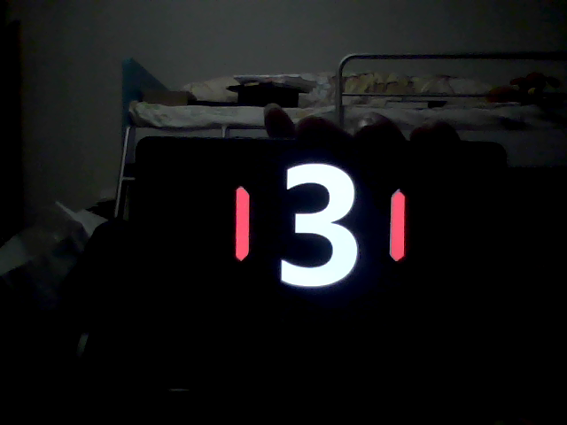
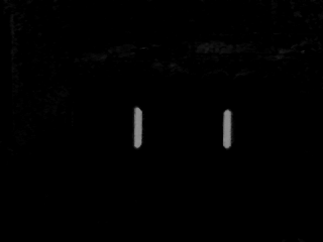
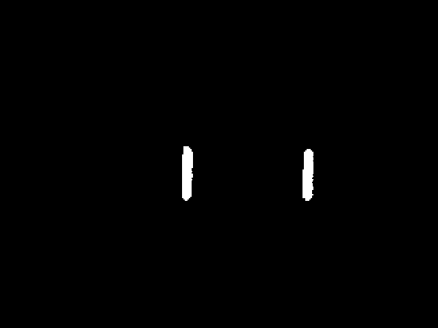
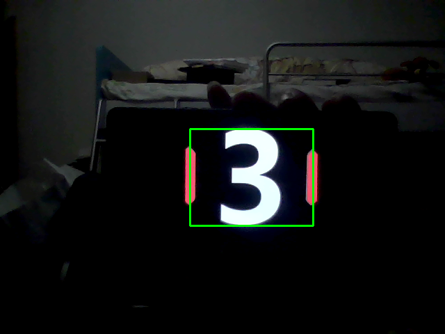
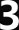
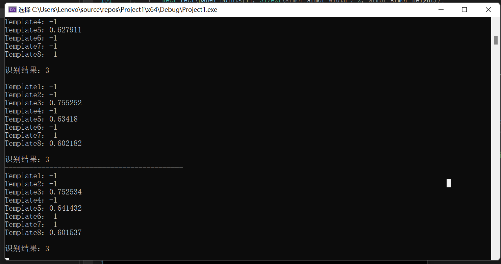

# Armor_Identifier

- [Armor_Identifier](#Armor_Identifier) 
  - [armor_Detector](#armor_Detector)
    - [preprocessImage](#preprocessimage)
    - [find_Lightbar](#find_Lightbar)
    - [draw_Armor_Panel](#draw_Armor_Panel)
  - [number_Identifier](#number_Identifier)
    - [extractNumbers](#extractNumbers)
    - [Identify](#Identify)

## Armor_Identifier
封装armor_Detector类和number_Identifier类，并提供test（）测试接口。

## armor_Detector
装甲板识别器

### preprocessImage
预处理

|  |  |  |
| :---------------: | :-------------------: | :--------------------: |
|       原图        |     R通道 - B通道      |         二值化         |

由于画面只有一个装甲板，且灯条为红色，可以通过split分离通道，再用R通道 - B通道使画面里红色物体变白，其他物体及背景相对变黑，在通过二值化后画面就只会出现灯条区域。

### find_Lightbar
寻找灯条

通过 findContours 得到轮廓，再通过 minAreaRect 获得最小外接矩形，对其进行长宽比判断，可以高效的筛除形状不满足的亮斑。

### draw_Armor_Panel
画出装甲板区域

由于画面只有一个装甲板，所以不需要配对灯条，识别到的灯条就是所示装甲板的灯条，再对装甲板区域适当扩大。

## number_Identifier
数字识别器

采取模板匹配的方法。对装甲板区域提取数字ROI，二值化后，再与同样参数二值化后的模板进行数据对比，对比后的数据可以明显体现出识别结果，所以采用模板匹配的方法。

### extractNumbers
提取数字

|  |  |  |
| :-------------------: | :-------------------: | :-------------------: |
|         原图          |         取ROI         |         二值化         |

考虑到数字图案和模板实质上就是黑色背景+白色图案，所以此处直接进行二值化，测试发现效果非常好。

### Identify
识别数字

|  |        |    |
|   :-------------------:    |   :----------------------:   | :---------------------: |
|         模板原图           |   resize后并二值化的模板图片   |        二值化后ROI       |

由于ROI的尺寸在识别过程中因装甲板位置不固定而变化，所以需要实时对模板进行缩放，利用resize()，经测试发现利用INTER_CUBIC方法并进行二值化可以最大减少缩放后，模板图片模糊对匹配结果的影响。

|              |
|       :-------------------:      |
|      对于ROI每个模板所得的得分     |

对模板和ROI中每个像素进行对比，并除与图片大小得到对于ROI每个模板所得的得分，挑选其最大值即为识别数字（得分过小置为-1表示匹配不上）